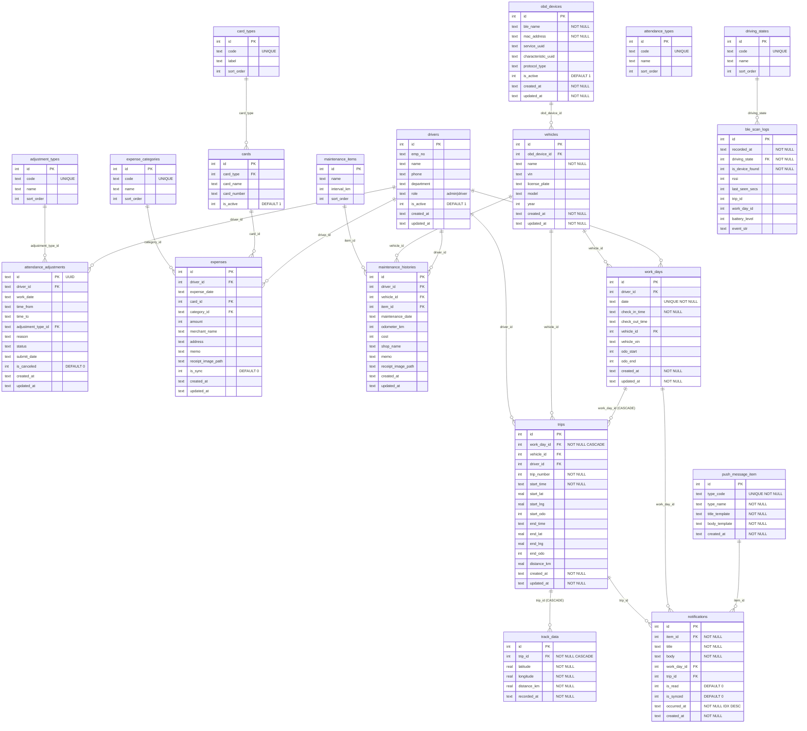

# SORIN DB ERD (Mermaid)

> 차량 운행 관리 앱의 로컬 SQLite 데이터베이스 — teble 관계도

## 전체 ERD



---

## 테이블 분류 요약

| 분류 | 테이블 | 관리 주체 | 특징 |
|---|---|---|---|
| ① 정의(마스터) | adjustment_types, attendance_types, card_types, driving_states, expense_categories, maintenance_items, push_message_item, obd_devices, vehicles, drivers, cards | Web Admin | 코드 테이블 + 장치/차량/운전자 기준정보 |
| ② 승인 관련 | attendance_adjustments, expenses, maintenance_histories | 원천시스템 동기화 | 결재 워크플로우, 서버 동기화 필요 |
| ③ 앱 생성 데이터 | work_days, trips, track_data, notifications | BLE 앱 자동 생성 | BLE OBD 연동, GPS 궤적, 운행일지 |
| ④ 로그 | ble_scan_logs | 앱 자동 기록 | 디버깅·분석용, RSSI/배터리/상태 이력 |

---

## 핵심 데이터 흐름

```
BLE 스캔 감지
  └─► driving_states 변경
        ├─► ble_scan_logs 기록 (로그)
        └─► work_days 생성 (출근)
              └─► trips 생성 (운행 시작)
                    ├─► track_data 누적 (GPS 궤적)
                    └─► notifications 발송 (알림)
```
